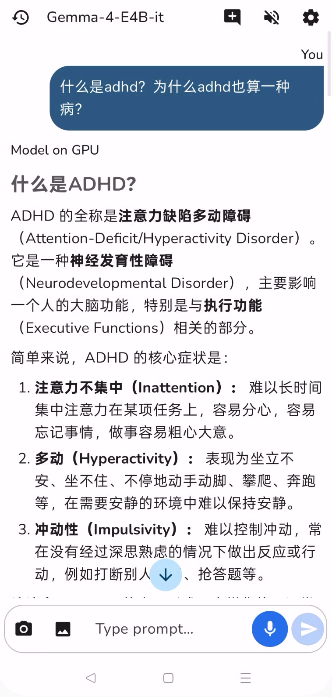

# Local Gemma


一个极简的 Android 端到端 LLM 聊天应用，**复用了 Google AI Edge Gallery 的代码**（模型管理、LiteRT-LM 推理、聊天界面、图片/音频输入），包装出一层精简的产品：**打开就是聊天，设置里管理模型和朗读**。



## 功能

- 支持两个端侧模型：**Gemma-4-E2B-it**（默认）与 **Gemma-4-E4B-it**。
- 启动即**自动加载上次保存的模型**，无需任何欢迎页/闪屏。
- 聊天支持文字、**拍照/相册图片**、**按住录音**（≤30s，16kHz）多模态输入。
- 模型回答**自动朗读**（读到第一个标点就开始），朗读语言跟随设置里的回答语言，**不读 markdown 符号**；语速（0.5–8x）/语调/音色可在设置页调节。
- 设置页：模型下载/删除/更新 + 模型参数（max tokens、top-k、top-p、temperature 等，可持久化）、回答语言（7 种）、TTS 选项。
- 顶栏：左=聊天历史抽屉，右=新聊天 / 自动朗读开关 / 设置；键盘 Enter 发送。

> 完整需求规格（中文）见仓库根目录的 [`README.md`](../README.md)。

## 快速开始

前置：JDK 17+、Android SDK（compileSdk 37）、真机（Android 11+，推荐 13+）。

```bash
cd app
./gradlew :app:installDebug     # 构建并安装
adb logcat -s LiteTtsManager AGMainActivity ModelManagerViewModel LlmChatViewModel
```

模型首次使用需在设置页**下载**（Gemma-4-E2B-it 约几百 MB）。下载完成后回到聊天页即自动初始化。

## 文档

维护本项目请先读 [`doc/`](doc/)：

| 文档 | 内容 |
| --- | --- |
| [doc/README.md](doc/README.md) | 文档索引 + 快速上手 |
| [doc/01-architecture.md](doc/01-architecture.md) | 总体架构：复用的 gallery 代码 vs 自写 lite 层 |
| [doc/02-screens-and-navigation.md](doc/02-screens-and-navigation.md) | 聊天页 / 设置页 / 导航 / 状态保持 |
| [doc/03-settings-and-datastore.md](doc/03-settings-and-datastore.md) | 设置键、DataStore、回答语言、模型参数持久化 |
| [doc/04-tts-read-aloud.md](doc/04-tts-read-aloud.md) | 朗读引擎回退 + markdown 剥离器设计 |
| [doc/05-model-management.md](doc/05-model-management.md) | 模型 allowlist / 下载 / 初始化 / 删除 / 更新 |
| [doc/06-chat-and-input.md](doc/06-chat-and-input.md) | 聊天生成 / 会话 / 历史 / 图片音频 / 按住录音 |
| [doc/07-gotchas.md](doc/07-gotchas.md) | 踩过的坑（改代码前必读） |
| [doc/08-build-and-file-map.md](doc/08-build-and-file-map.md) | 构建部署命令 + 源码文件地图 |

## 工程说明

- **安装包名**：`com.example.edgegallerylite`；源码包：`com.google.ai.edge.gallery`；本项目自定义代码在 `com.google.ai.edge.gallery.lite` 包下。
- 技术栈：Kotlin 2.2.0 / Jetpack Compose + Material3 / Hilt / Proto DataStore / LiteRT-LM / WorkManager。版本见 `gradle/libs.versions.toml`。
- 本项目不依赖 `google-services.json`（Firebase 可选），无网络也能构建运行。
